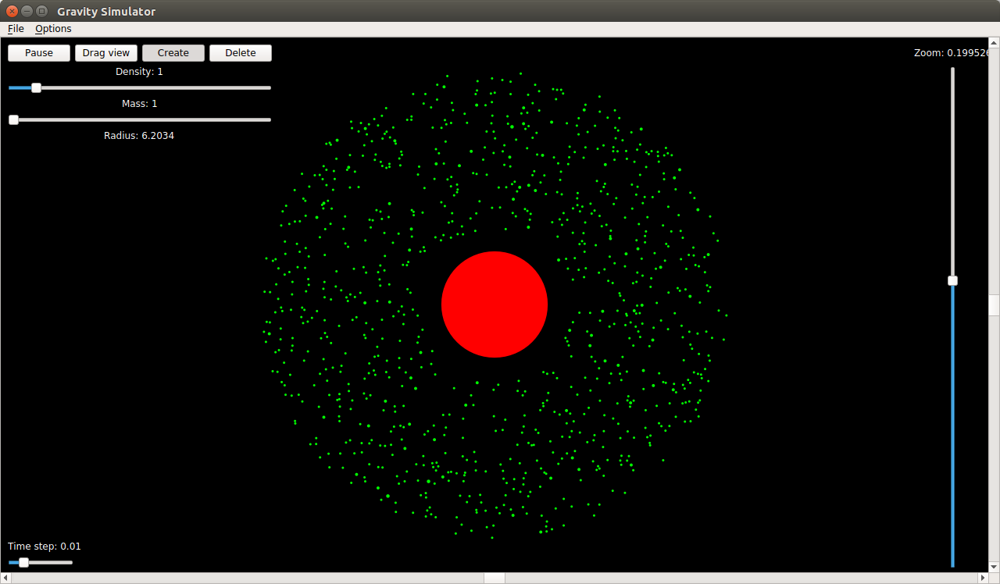
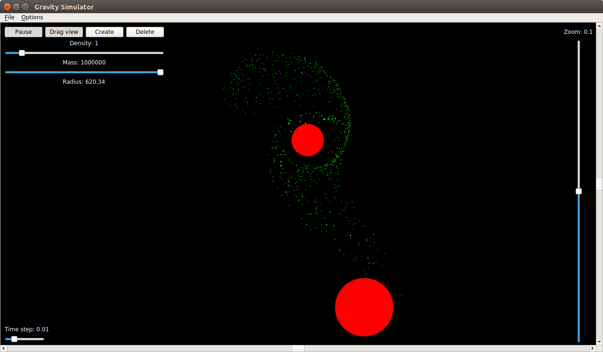
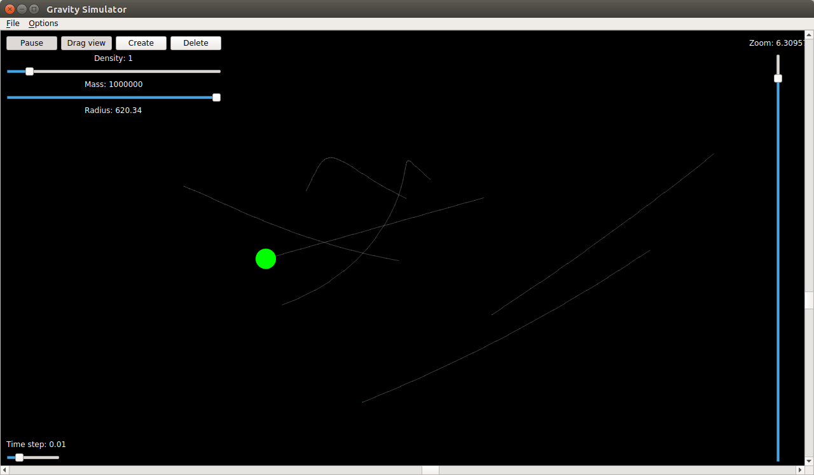
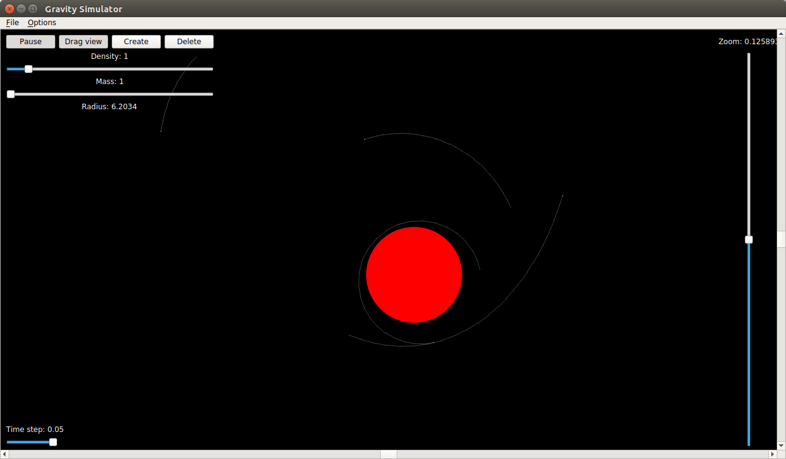

# 2D Nbody Gravity Simulator

This is 2D N-Body Gravity simulator created in C++ with Qt 5 libraries.

You can create new planet-like object by pressing and holding left mouse button, moving towards direction it shall move and releasing the button.  
There are also options for removing objects, dragging view, zooming view and pausing simulation.

All objects influence each other through the force of gravity. Calculations are performed using [Euler](https://en.wikipedia.org/wiki/Euler_method) or [Runge-Kutta](https://en.wikipedia.org/wiki/Runge%E2%80%93Kutta_methods) method (choice in option menu). You can also specify time step of simulation.  
Objects can have different masses and sizes. They merge with each other on collision.

Trails behind objects and antialiasing can be switched on in option menu.  

There are also two prepared presets:
* The Solar System
* [Protostar](https://en.wikipedia.org/wiki/Protostar) with [protoplanetary disk](https://en.wikipedia.org/wiki/Protoplanetary_disk)

Tested on Ubuntu Linux and Windows.
